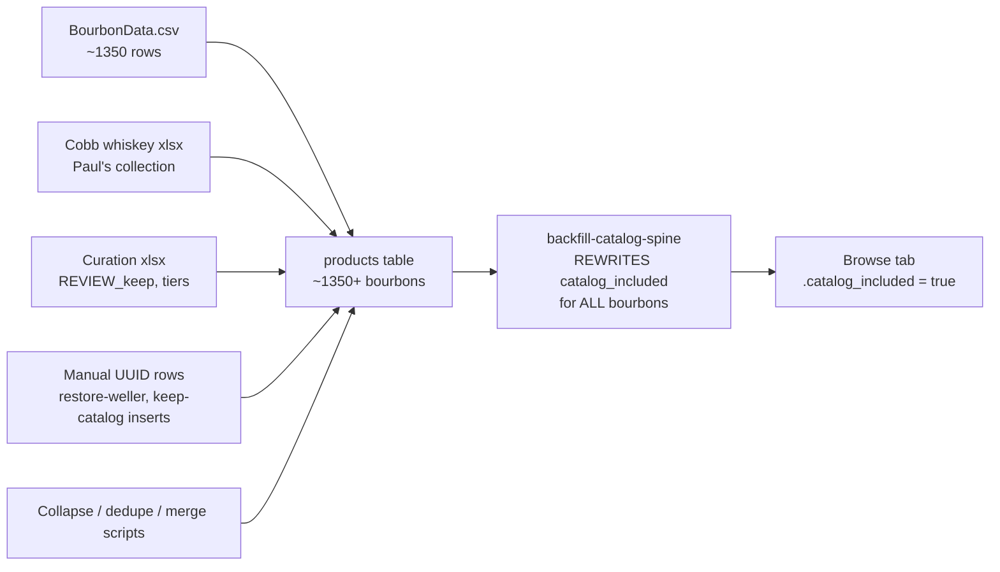
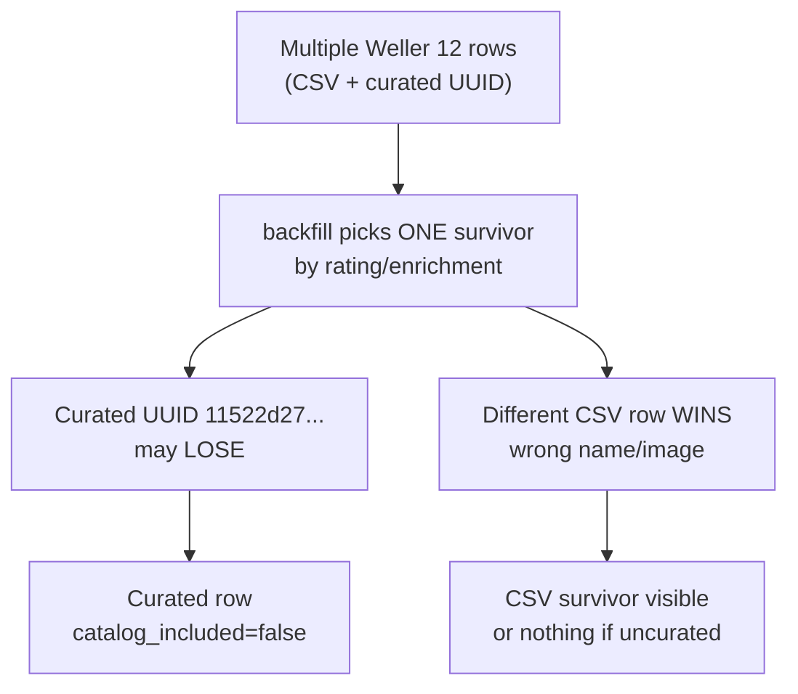

# Bourbon Catalog — What's Actually Going On

## The confusion (in plain terms)

You are not imagining it. **Weller Antique 107 and Weller 12 Year did show up before.** They are real rows in Supabase — not from `BourbonData.csv`. Something in the pipeline **hid them again** after a later step ran.

The browse tab is simple: it only loads products where **`catalog_included = true`**, grouped by **`brand_family`**. Everything else still exists in the DB (with photos, Cobb flags, enrichment) but is invisible in the member catalog.

So when a bottle "disappears," nothing was deleted — **`catalog_included` was flipped to false**, or **`brand_family` changed** so it landed under the wrong divider.

---

## The catalog has many sources (CSV is just one)



| Source | Script | What it adds |
|---|---|---|
| bourbonExplorer CSV | [`seed-bourbons.ts`](apps/web/scripts/seed/seed-bourbons.ts) | Bulk baseline; soft-merges with Cobb rows |
| Paul's collection | [`seed-cobb-whiskey.ts`](apps/web/scripts/seed/seed-cobb-whiskey.ts) | Bottles Paul owns; `specs.in_cobb_collection=true` |
| Review spreadsheet | [`apply-bourbon-catalog-review.ts`](apps/web/scripts/seed/apply-bourbon-catalog-review.ts) | Tiers, rarity, keep/remove |
| Audit / new rows | [`insert-catalog-new-rows.ts`](apps/web/scripts/seed/insert-catalog-new-rows.ts) | Inserts where `product_id` empty + `REVIEW_keep=Y` |
| Surgical patches | [`apply-keep-catalog-fixes.ts`](apps/web/scripts/seed/apply-keep-catalog-fixes.ts) | UUID-level fixes + gap inserts (Four Roses, Jim Beam, etc.) |
| Weller / Taylor restore | [`restore-weller-catalog.ts`](apps/web/scripts/seed/restore-weller-catalog.ts), [`restore-taylor-catalog.ts`](apps/web/scripts/seed/restore-taylor-catalog.ts) | **Stable UUIDs** from [`catalog-curation-review.xlsx`](data/catalog-curation-review.xlsx) |

**Weller Antique 107 is not in BourbonData.csv.** It was added and curated as a stable product row:

| Bottle | Pinned UUID (from restore-weller) |
|---|---|
| Weller Special Reserve | `42806bc0-a625-41b7-aa2b-8dbdd184a6e0` |
| Weller 12 Year | `11522d27-ad80-4200-8fe6-517cae5e0ea7` |
| Weller Antique 107 | `c110f18f-6efd-470b-a2b2-7523ae261344` |

CSV *does* have other Weller rows (`W.L. Weller 12 year old`, `W.L. Weller Special Reserve`, etc.) — often **duplicate import strings for the same expression**. The spine dedupes those to one survivor per expression — but the **curated UUID is not necessarily the survivor**.

---

## Why you keep going in circles (root cause)

There are **two competing systems** that both touch visibility:

### System 1 — Human curation (what you did)

- Review xlsx, restore-weller, apply-keep-catalog-fixes
- Sets correct **names, brands, expression_type, images** on **specific UUIDs**
- Previously made 107 + 12 visible (either `catalog_included=true` directly, or pre-spine when everything defaulted visible)

### System 2 — Automated cut-back ([`backfill-catalog-spine.ts`](apps/web/scripts/seed/backfill-catalog-spine.ts))

On every `--apply`, for **every bourbon row**, it recomputes and **overwrites**:

- `brand_family`, `expression`, `is_core_range`
- **`catalog_included`** ← the browse on/off switch

Inclusion rule ([`spine-match.ts`](apps/web/scripts/seed/lib/spine-match.ts) `planCutback`):

- Paul owns it (`in_cobb_collection`) → always kept
- Else: must be the **survivor** of its expression group AND (curated core/limited OR Cobb-brand lineup opened)
- Non-survivors → **`catalog_included = false`**

Survivor is picked by score: **Cobb-owned (+1000) > has image/wheel (+100) > CSV rating** — **not** "is this the curated UUID from the xlsx."



**Critical gap:** [`restore-weller-catalog.ts`](apps/web/scripts/seed/restore-weller-catalog.ts) fixes `name`, `brand`, `specs` on the pinned UUIDs — but does **not** set `catalog_included`, `brand_family`, or `expression`. So:

1. You restore Weller → looks good in admin / xlsx
2. Someone runs `backfill-catalog-spine --apply` (often after a spine code change)
3. Backfill hides the curated UUID, promotes a different duplicate → **107 alone might survive** (only one row for that expression, or it wins survivor score) while **12 Year vanishes**

That is the circle: **curation fixes identity; backfill re-decides visibility; restore scripts don't re-pin visibility.**

The previous plan had Phase 1 order wrong: **never run backfill --apply without immediately re-pinning shelf rows afterward.**

---

## What browse actually renders

[`catalog-queries.ts`](apps/web/src/lib/feed/catalog-queries.ts):

```sql
.eq("catalog_included", true)
```

[`catalog-card.tsx`](apps/web/src/components/feed/catalog-card.tsx) shows **`entry.name`** (noisy CSV string), not `entry.expression`. Subtitle comes from `specs.expression_type` / age / proof — so mis-tagged specs show wrong expression labels even when grouping is correct.

---

## Structural fix (stop the regressions)

### A. Pin curated shelf rows (required)

Extend restore-weller (and similar) to also set on each `SHELF_IDS` UUID:

```typescript
catalog_included: true,
brand_family: "Weller",
expression: "Weller 12 Year" | "Weller Antique 107" | "Weller Special Reserve",
is_core_range: true,
specs: { curation_collapse: "N", curated_expression: "..." }
```

Add the same pattern to [`apply-keep-catalog-fixes.ts`](apps/web/scripts/seed/apply-keep-catalog-fixes.ts) for all pinned shelf brands (Taylor, Four Roses inserts, etc.).

**Optional hardening:** teach `planCutback` / backfill to always keep rows with `specs.curation_pinned = true` (new flag set by curation scripts).

### B. Fixed run order (document in repo)

```bash
# 1. Spine code merged (origin/main 552fb32+)
# 2. Classifier pass — preview only
pnpm tsx --env-file=apps/web/.env.local apps/web/scripts/seed/backfill-catalog-spine.ts

# 3. Apply classifier fields + cut-back
pnpm tsx --env-file=apps/web/.env.local apps/web/scripts/seed/backfill-catalog-spine.ts --apply

# 4. IMMEDIATELY re-pin human-curated rows (visibility + identity)
pnpm restore:weller --apply
pnpm restore:taylor --apply
pnpm apply:keep-catalog-fixes --apply

# 5. Browse verify
```

**Rule:** If you change [`brand-spine.ts`](apps/web/scripts/seed/lib/brand-spine.ts), you must run steps 2–4 together — never step 3 alone.

### C. Audit query (first thing to run)

For the three Weller shelf UUIDs, check in Supabase:

```sql
SELECT id, name, brand_family, expression, catalog_included,
       specs->>'in_cobb_collection' AS cobb,
       specs->>'expression_type' AS expr_type,
       image_url IS NOT NULL AS has_image
FROM products
WHERE id IN (
  '42806bc0-a625-41b7-aa2b-8dbdd184a6e0',
  '11522d27-ad80-4200-8fe6-517cae5e0ea7',
  'c110f18f-6efd-470b-a2b2-7523ae261344'
);
```

Also find duplicate Weller 12 expression competitors:

```sql
SELECT id, name, catalog_included, expression, brand_family
FROM products
WHERE type = 'bourbon'
  AND (name ILIKE '%weller%12%' OR expression ILIKE '%12%')
ORDER BY catalog_included DESC, name;
```

Expected finding: **curated 12 Year row has `catalog_included = false`** while a noisier CSV duplicate is true — or 12 Year has wrong `brand_family`.

---

## Remaining brand issues (unchanged diagnosis, updated context)

Same four failure modes as before, now understood through the visibility lens:

| Mode | Symptom | Examples from your list |
|---|---|---|
| **Backfill unpins curation** | Had it, now gone | Weller 12, possibly SR |
| **Missing CORE_RANGES** | Never shows unless Cobb | E.H. Taylor, Booker's, Widow Jane |
| **Wrong survivor / expression** | Wrong photo, duplicate cards, wrong subtitle | Taylor SB/Sm Batch swap, Knob Creek 2×9yr, Larceny |
| **Not in any seed source** | Needs manual insert | Willett Pot Still, Maker's DNA (Cobb) |

**Local repo:** still at `f1589dc`; `origin/main` has `552fb32` spine expansion — pull before spine work.

---

## Updated execution phases

### Phase 0 — Explain + audit (do first)

1. Run Weller audit SQL above — confirm which row is visible vs hidden.
2. `git pull origin main`
3. Export visible catalog (`export-catalog-curation --visible-only`) and diff against last good export in [`data/catalog-curation-visible-export-2026-05-28.xlsx`](data/catalog-curation-visible-export-2026-05-28.xlsx) if available.

### Phase 1 — Pin shelf rows in code

- Extend `restore-weller-catalog.ts` with `catalog_included`, `brand_family`, `expression` on `SHELF_IDS`.
- Extend `apply-keep-catalog-fixes.ts` with patches for 107 + 12 Year UUIDs (not just SR).
- Consider `specs.curation_pinned` respected by backfill.

### Phase 2 — Spine overlays (Taylor, Booker's, etc.)

Same as prior plan — add missing `CORE_RANGES` entries on [`brand-spine.ts`](apps/web/scripts/seed/lib/brand-spine.ts).

### Phase 3 — Run pipeline in fixed order

Backfill → restore-weller → restore-taylor → keep-catalog-fixes → browse verify.

### Phase 4 — Optional UI polish

Show `expression` on catalog card title when present (cleaner than raw CSV `name`).

---

## Acceptance — Weller specifically

Under one **Weller** divider, member browse shows exactly:

- Weller Special Reserve
- Weller 12 Year (`11522d27-...`)
- Weller Antique 107 (`c110f18f-...`)

…regardless of how many duplicate CSV import rows exist, and **survives a backfill re-run** because shelf UUIDs are pinned after cut-back.

---

## Why this stops the circle

| Before | After |
|---|---|
| Curation and backfill fight over `catalog_included` | Pinned UUIDs re-promoted every time after backfill |
| restore-weller fixes name only | restore-weller fixes name **and visibility** |
| "We fixed Weller" then spine change → regression | Documented 3-step ritual: backfill → pin → verify |
| CSV assumed to be source of truth | **Curation xlsx UUIDs** are source of truth for shelf lineup; CSV fills long tail |
